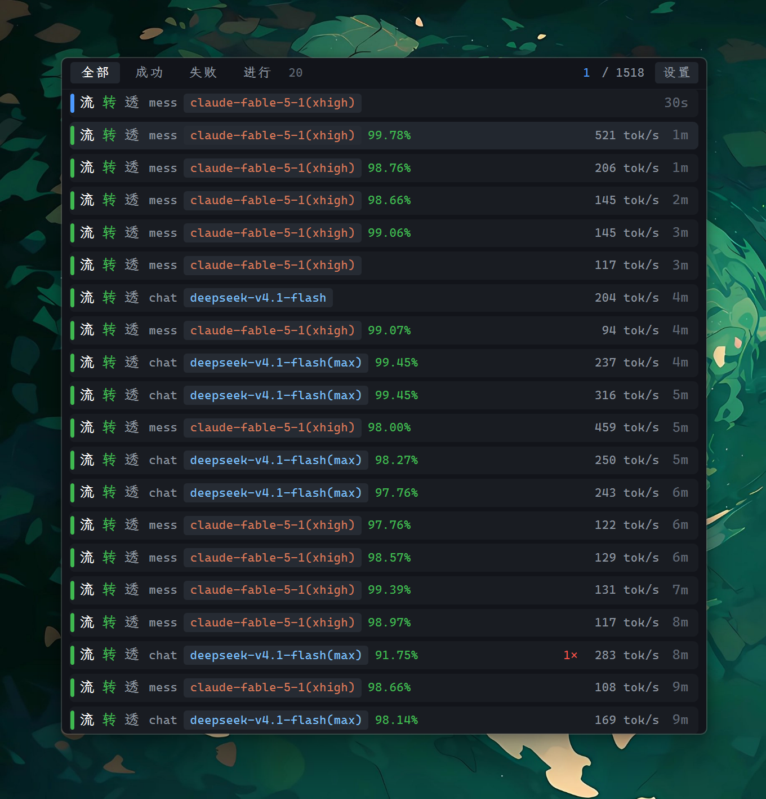
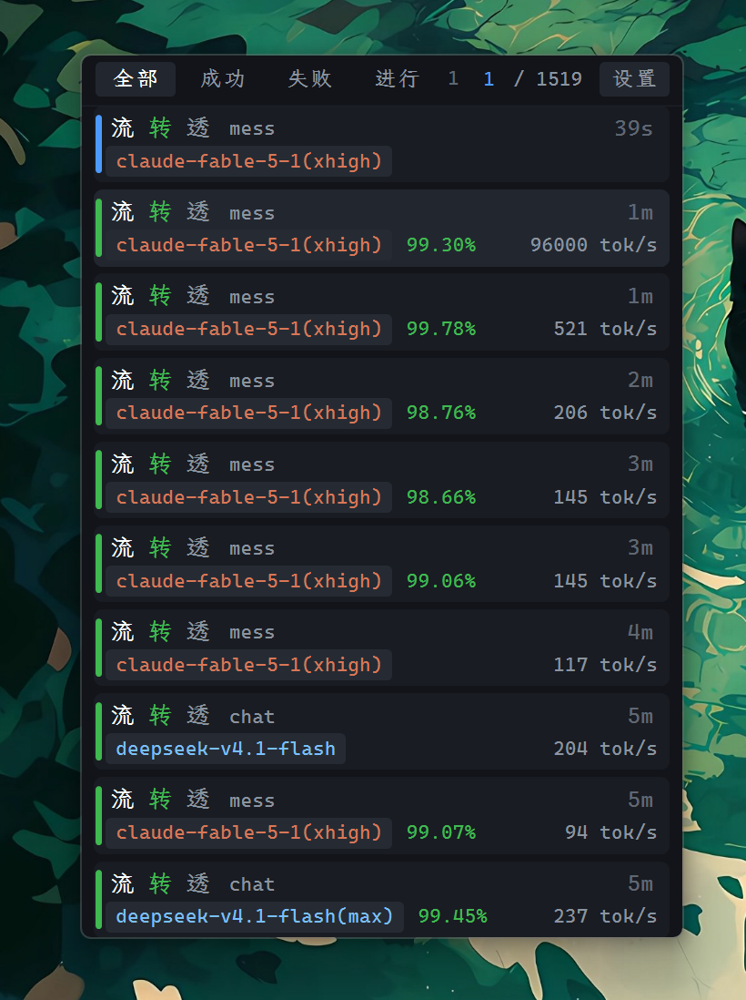

# Axonhub Panel

AxonHub 请求日志监控面板





## 特性

- **低占用**:GDI+ 自绘,常驻约 15 MB,空闲 CPU 0%。
- **实时**:有请求进行中时 2 秒轮询,空闲时 5 秒;服务异常时指数退避(2s → 30s)。

## 构建

仅支持 Windows(依赖 Win32 消息循环、GDI+/GDI 与 DPAPI)。需要 Rust 1.85+(edition 2024)。

```bash
cargo run --release      # 构建并运行,首次启动弹出登录窗
cargo build --release    # 仅构建,产物在 target/release/ah-panel.exe
cargo test               # 运行内置单元测试
```

## 使用

首次启动弹出登录表单,有两种方式:

### 访问令牌

在浏览器打开 AxonHub,打开开发者工具 → Network,随便点一个 `/admin/graphql`
请求,复制请求头的令牌 `eyJ...`,粘贴到表单的「访问令牌」页签。

不会保存账号密码,只保存令牌。令牌有效期 7 天,过期后重新抓一个即可。

也可以用环境变量传入,完全不落盘:

```powershell
$env:AXONHUB_ACCESS_TOKEN = "eyJhbGciOi..."
cargo run --release
```

环境变量优先于本地保存的令牌。变量名可在配置里改(`tokenEnvVar`)。


### 凭据保存方式

表单上的「凭据:」一行点击可循环切换三种模式:

| 模式 | 行为 |
|---|---|
| `token`(默认) | 仅加密保存访问令牌,不保存密码;7 天后需重新登录 |
| `password` | 加密保存邮箱和密码,自动静默登录,永不打扰 |
| `none` | 什么都不保存,每次启动重新输入 |

全部使用 **Windows DPAPI** 加密(绑定当前用户账户),存放在
`%APPDATA%\ah-panel\credentials.bin`。

### 操作

| 操作 | 说明 |
|---|---|
| 拖动标题栏/空白区域 | 移动面板 |
| 拖动边缘 | 调整窗口大小(高度变化后自动调整拉取条数) |
| 单击**带失败记录**的卡片 | 弹出错误详情(状态码、渠道、错误日志…),见下文 |
| 滚轮 | 上下滚动 |
| 标题栏「设置」或右键「设置…」 | 打开独立设置窗口 |
| 右键 | 设置 / 刷新 / 打开请求页 / 显示数量 / 字号 / 单行模式 / 固定窗口位置 / 置顶 / 置底 / 退出 |

> 可点击的卡片 = 失败(`failed`)、取消(`canceled`),以及**最终成功但有失败尝试**的请求
> (重试后成功,`attempt` 里有失败记录)。鼠标移上去会变手型;其余卡片整块都是窗口的拖动区,
> 因此误点不会弹出任何东西。窗口边缘 6px 内是缩放区。


## 卡片信息

每张卡片三行,对应 AxonHub 请求页的列:

1. `#请求号` · 相对时间 · 成本
2. 模型(**只显示实际服务的模型**;若与请求的模型不同则为金色 `#E8B33A` 以提示发生了路由)
   · 推理强度 · 协议 · 透传标记 · 重试次数

   协议单元格:两侧相同显示 `messages`(灰),发生转换显示 `messages→chat`(**金色**),
   任一侧缺失则显示已知的那一侧(灰,不声称"一致")。透传为真时附加金色 `透传` 徽章
   —— 为假时不显示,因为「未透传」是常态,标出来只是噪音。
3. 渠道 · 缓存命中率(命中率低且 prompt ≥ 40k 时标红)· 词元 · `总耗时 / 首字耗时`
   · **调用方**(最右,API key 名 + 所属用户,如 `cc · alice`)

> 这些字段都能在「设置 → 属性显示」里逐项关掉。关掉只影响绘制:卡片高度与布局不变,
> 该项留空;状态色条不在此列,它始终显示。

## 配置

`%APPDATA%\ah-panel\config.json`,首次运行自动生成:

```jsonc
{
  "endpoint": "http://localhost:8090",
  "projectId": "gid://axonhub/Project/1",
  "pollSeconds": 5,          // 空闲轮询间隔
  "activePollSeconds": 2,    // 有请求进行中时的间隔
  "rowLimit": 12,            // 由窗口高度自动推导
  "credentialMode": "token", // token | password | none
  "tokenEnvVar": "AXONHUB_ACCESS_TOKEN",
  "alwaysOnTop": true,
  "pinPosition": false,      // 固定位置:开启后不可拖动、不可改大小
  "alwaysOnBottom": false,
  "fontSize": 12.5,          // 正文字号(96 DPI 基准像素);右键「字号」可在 10–24 间调整,整面板等比缩放
  "fontFamily": "",          // 本地字体名称;空字符串使用默认字体，可在设置的「字体」页搜索选择
  "singleLine": false,       // 单行模式:每张卡片一行、面板更矮;右键「单行模式」切换
  // width/height 是 96 DPI 逻辑单位,与显示器缩放无关;x/y 是屏幕坐标(设备像素)。
  "window": { "x": -1, "y": -1, "width": 452, "height": 602 }
}
```

`x`/`y` 为 `-1` 表示首次运行,自动放到工作区右上角。

## 数据来源

复用 AxonHub 前端的 `GetRequests` 的字段选择:

```
POST {endpoint}/admin/graphql
Authorization: Bearer <JWT>
X-Project-ID: gid://axonhub/Project/1

query GetRequests($first, $where, $orderBy) { requests(...) { ... } }
```

> `modelID`、`apiKey`、`clientIP` 是全大写缩写,不是标准 camelCase;
> `serde(rename_all = "camelCase")` 会静默地把它们变成 `None`,故需显式 `rename`
> (`requestURL`、`baseURL` 同理)。

错误详情另发一次 `GetRequestExecutions`(同样来自前端详情页的查询),按请求 GUID 取执行记录:

```
query GetRequestExecutions($requestID: ID!, $first: Int, $orderBy: RequestExecutionOrder) {
  node(id: $requestID) { ... on Request { executions(...) { edges { node { ... } } } } }
}
```

> 详情页链接为 `/project/requests/{URL 编码后的 GUID}`,例如
> `http://localhost:8090/project/requests/gid%3A%2F%2Faxonhub%2FRequest%2F34009`。
> 该路由要求完整 GUID 且必须编码:`:` 和 `/` 不编码会落到 404,并提示
> `guid must start with gid://axonhub/`。

## 结构

| 文件 | 职责 |
|---|---|
| `main.rs` | 窗口生命周期、消息循环、输入分发 |
| `app.rs` | 面板状态 |
| `worker.rs` | 后台轮询线程 |
| `client.rs` | GraphQL / 登录 HTTP |
| `model.rs` | 数据结构与行转换 |
| `config.rs` | 配置读写、凭据模式与 DPAPI 存储 |
| `token.rs` | JWT 有效期解析 |
| `theme.rs` | 配色、GDI+ 绘制原语、中英文分段绘制(`split_runs`) |
| `ui/layout.rs` | 几何布局(纯计算,含 DPI 缩放,可测) |
| `ui/panel.rs` | 请求卡片渲染 |
| `ui/detail.rs` | 错误详情弹窗的内容模型、换行布局与绘制 |
| `ui/login.rs` | 登录表单 |
| `ui/settings.rs` | 设置页签、控件布局、绘制与键盘导航 |
| `ui/font_search.rs` | 支持中文输入法的原生字体搜索框 |
| `font_catalog.rs` | 本地字体枚举与中文覆盖检测 |
| `popup.rs` | 弹窗点击位置定位与失焦关闭 |
| `settings_window.rs` | 设置窗口生命周期、交互与账号编辑往返 |